Epic Battle Challenge
=====================

A simple battle game for signle or two players, where each player can choose his own (Family Guy themed) character and attack the opponent using various types of attacks.


**Objective**
-------------------------------
Building a game based on received wireframes. The project uses Ruby, HTML, CSS, Sinatra and Capybara technologies.

-----

|   Description   |   Image    |
|:------------:|:----------------:|
|User enters the main page| 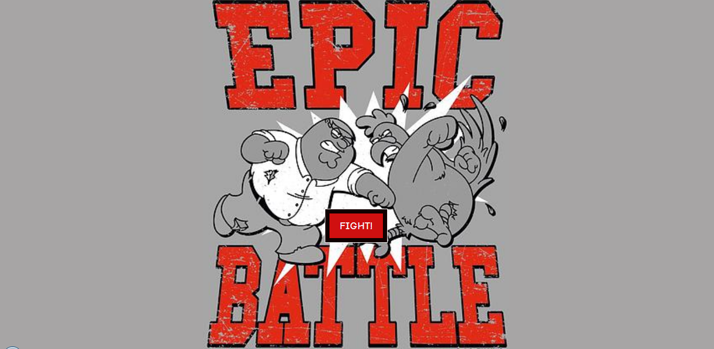|
|User can choose between single player and player vs player mode| 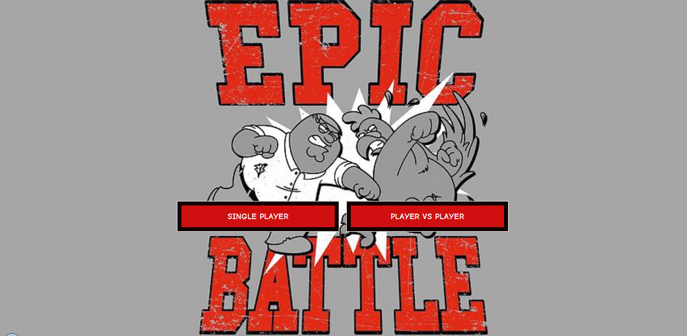|
|User enters character selection menu| 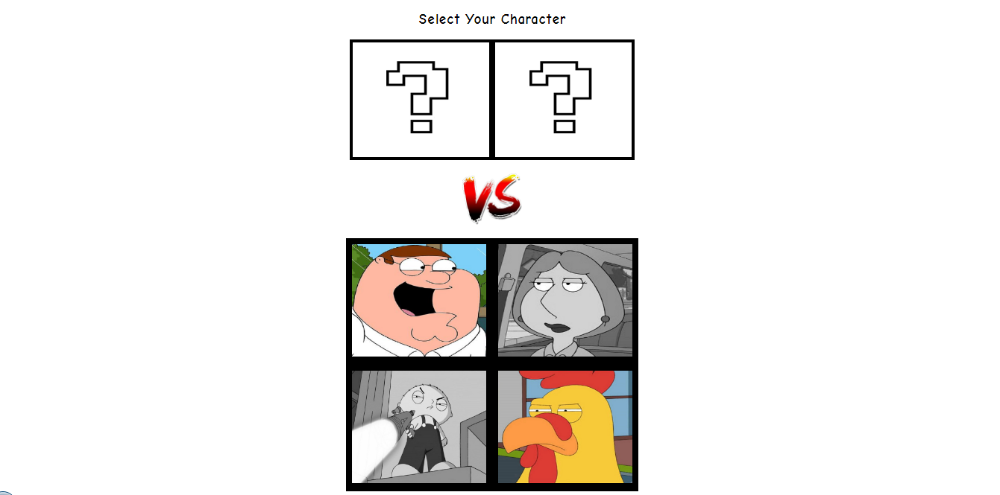|
|Player 1 selects his character| 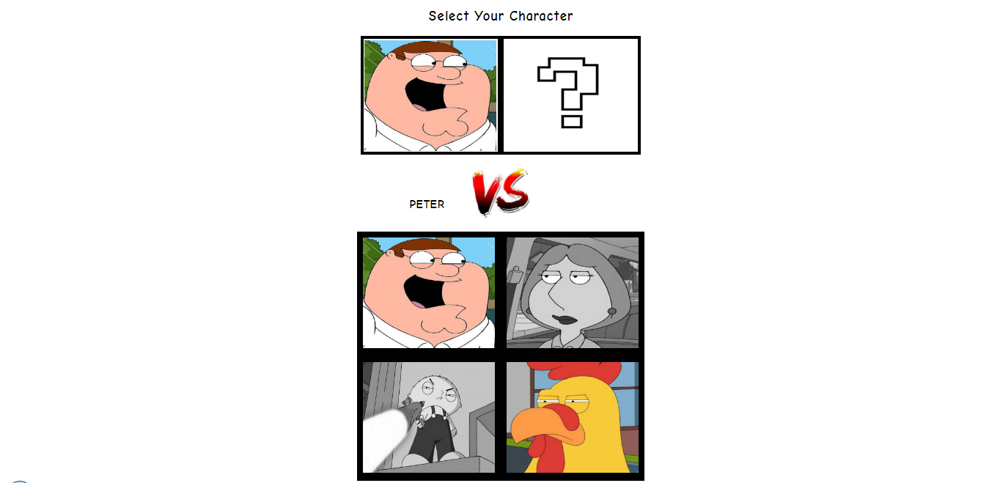|
|Player 2 selects his character. In case of single player mode, second player's character is selected randomly| 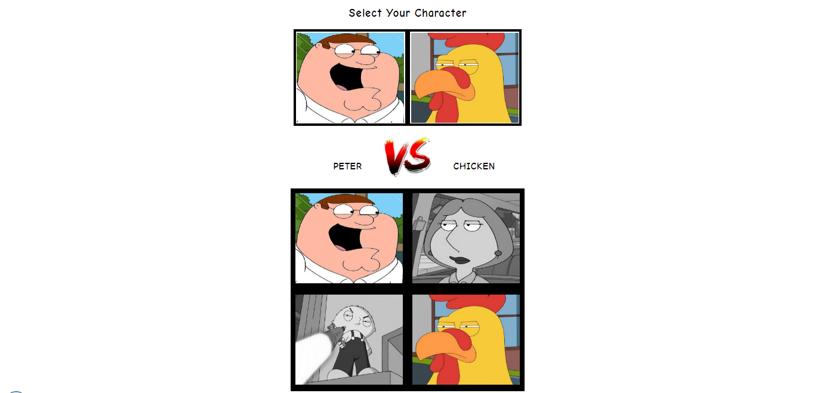|
|Player can select one of the three attacks each turn to attack the opponent. The third attack is unique to each character | 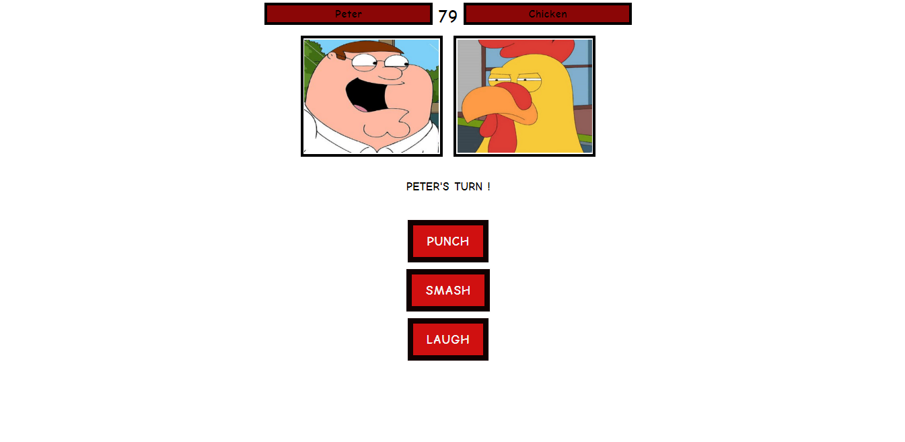|
|Each attack has its own graphic representation and reduces certain amount of opponent's HP which shows up on the screen | 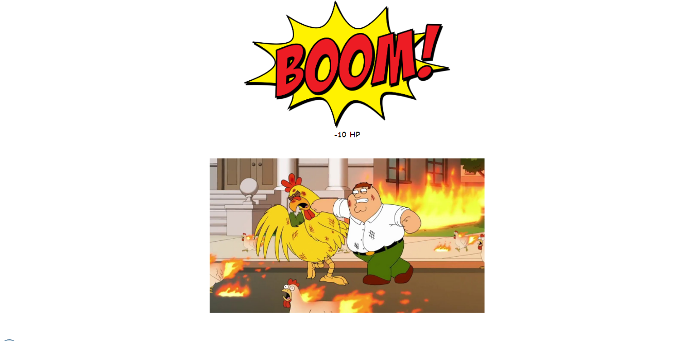|
|Each turn HP bars show the amount of HP remaining| 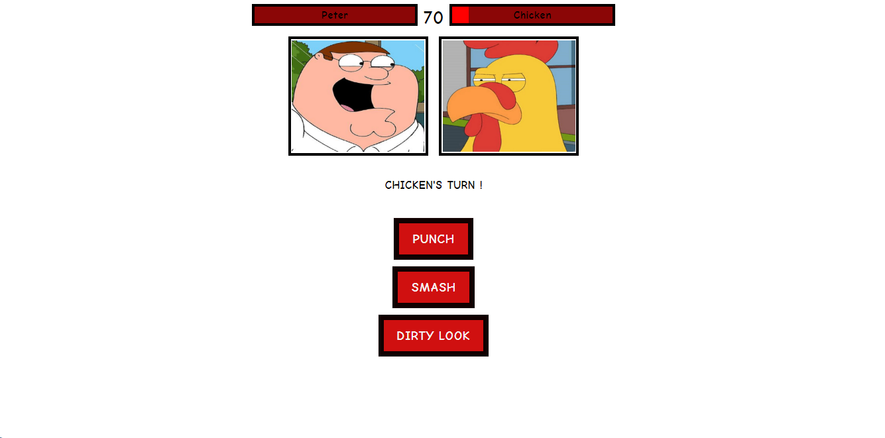|
|Graphic representations of the attacks are unique to every character| 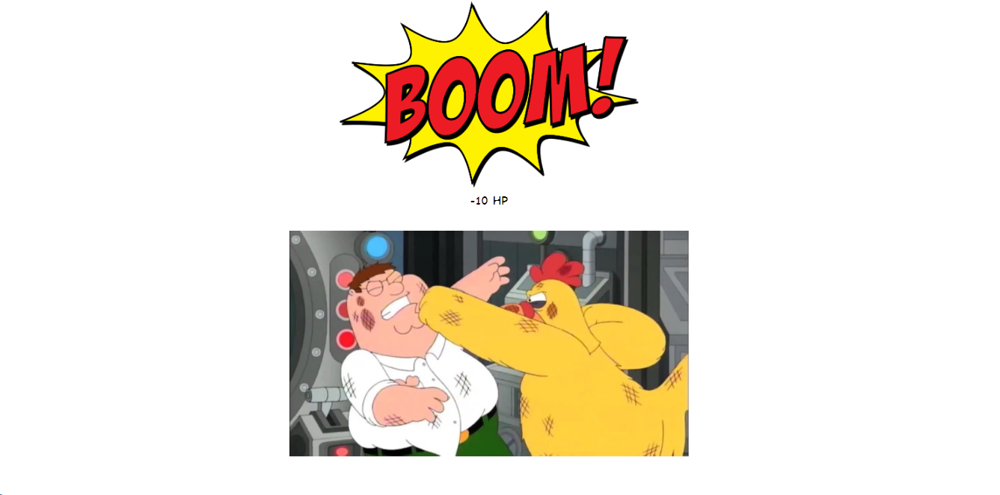|
|Each attack reduces different amount of opponent's HP | 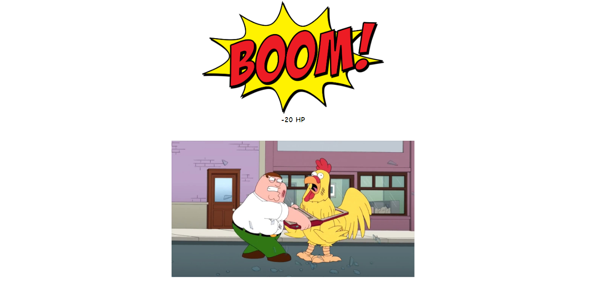|
|After each fight we can see who is the winner. Each character has its own graphics in case of losing the battle | 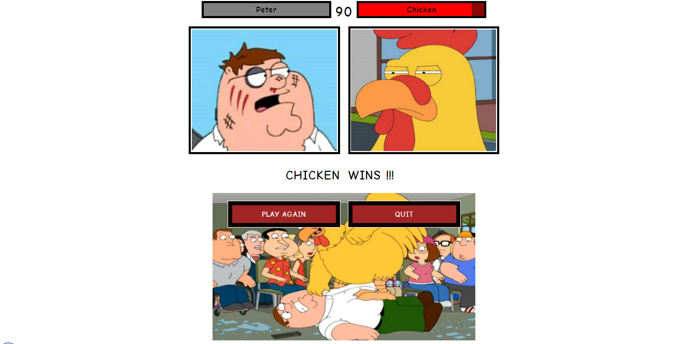|
|After each battle player can choose to play again or quit | 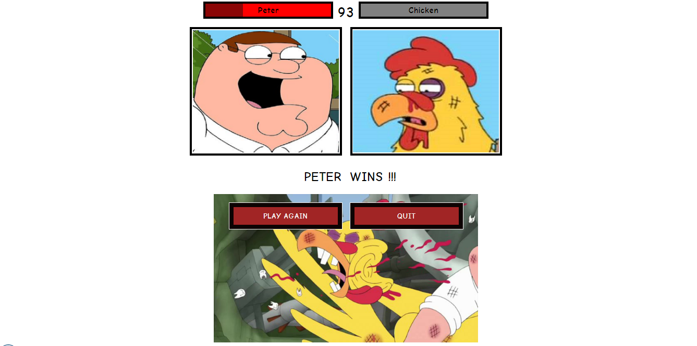|

-----


**Challenge setup**
-------------------------------

Here are the complete User Stories for this project. They begin with some 'Basic' User Stories:

```
As two Players,
So we can play a personalised game of Epic Battle,
We want to Start a fight by selecting our characters and seeing them

As Player 1,
So I can see how close I am to winning
I want to see Player 2's Hit Points

As Player 1,
So I can win a game of Epic Battle,
I want to attack Player 2, and I want to get a confirmation

As Player 1,
So I can start to win a game of Epic Battle,
I want my attack to reduce Player 2's HP

As two Players,
So we can continue our game of Epic Battle,
We want to switch turns

As Player 1,
So I can see how close I am to losing,
I want to see my own hit points

As Player 1,
So I can lose a game of Epic Battle,
I want Player 2 to attack me, and I want to get a confirmation

As Player 1,
So I can start to lose a game of Epic Battle,
I want Player 2's attack to reduce my HP


And some Advanced 'extension' User Stories:


As a lonely Player,
So I can keep my Battle skills up to scratch
I want to play a Computerised opponent

As a Player,
So I can enjoy a game of Battle with more variety,
I want to choose from a range of attacks I could make

As a Player,
So I can enjoy my game of Battle,
I want a sexy user interface
```
